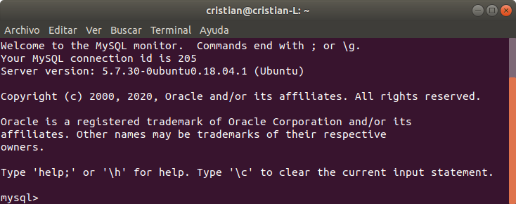

# Cine 

## Base de datos

Una vez instalado MySQL procedemos a la generación de tablas y carga de información.

En la terminal:

~~~
$ mysql -u [nombre_usuario] -p
~~~

Una vez se ha accedido a consola de MySQL.

1. Creamos las tablas, el código para crear la BD lo puedes encontrar en [cine.sql](cine.sql).
2. Insertamos los datos en las tablas creadas, los datos los puedes encontrar en [inserccionDatosCine.sql](cine.sql)

~~~diff
! OJO
~~~
Las fechas de las sesiones hay que cambiarlas por las actuales.