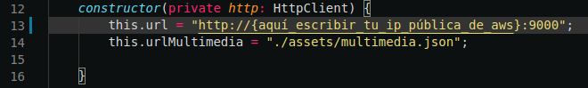

# Cine 

## Parte cliente

## Implantación paso a paso ⚙️

**RECUERDA** es necesario modificar esta parte del código:

Por esta otra:

Se encuentra en el archivo [peticiones.servicio.ts](Cine/cineCliente/src/servicios/peticiones.servicio.ts)

Para desplegar la parte cliente de la aplicación, en la terminal usaremos la siguiente instrucción:

~~~
$ ng serve --host {aquí_escribir_la_ip_pública_de_aws}
~~~

Para dejar la aplicación en segundo plano ejecutamos en la terminal las siguientes instrucciones:

~~~
$ CTRL + Z
$ jobs (miramos que número corresponde a ng)
$ bg {número_de_ng}
~~~

Con esto tendríamos nuestra App desplegada.

---

