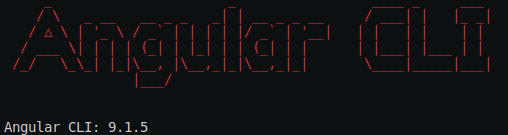
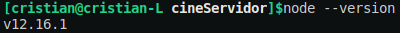
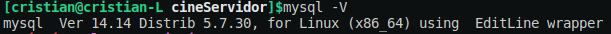
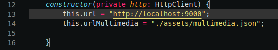
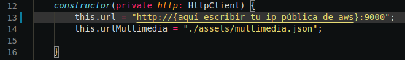

# Aplicación Web Cine 

Se trata de una aplicación web desarrollada para el Proyecto Integrado del Grado Superior de Desarrollo de Aplicaciones Web del IES Polígono Sur.

La finalidad del proyecto es realizar la aplicación web de un cine que permita ver la cartelera, consultar sus tarifas por parte de un usuario no registrado.
Para un usuario registrado además de realizar las anteriores operaciones, cabe la posibilidad de realizar una reserva y/o valorar una película. También dispone de un 
apartado de administración, del cuál se encarga un usuario con rol de administrador, solo accesible para este usuario.

El administrador puede añadir, modificar y eliminar: películas, sesiones y tarifas.

El proyecto se compone de una parte Front End que se encuentra en la carpeta [cineCliente](Cine/cineCliente), de una parte Back End que se encuentra en la carpeta
[cineServidor](Cine/cineServidor) y una [base de datos](Cine/DB).

Para la parte del **Front End** he optado por el uso de Angular, más concretamente **Angular CLI 9.1.5**.

Para la parte del **Back End** he optado por el uso de NodeJS en su versión **v12.16.1**.

Para la persistencia de datos he decidido usar MySQL **Ver 14.14 Distrib 5.7.30**.

## Comenzando 🚀

Las indicaciones son para un entorno Linux.

_Use el comando git_

~~~
$ git clone https://github.com/CristianBY/Cine.git
~~~

_Checkout con svn use la URL:_

~~~
$ svn checkout https://github.com/CristianBY/Cine.git
~~~

## Requisitos 📋

- Tener git instalado

~~~
$ sudo apt-get install git
~~~

- Tener NodeJs instalado -> [https://nodejs.org/es/](https://nodejs.org/es/)

- Actualizar npm

~~~
$ npm install -g npm@latest
~~~

- Instalar la última versión de Angular

~~~
$ npm install -g @angular/cli@latest
~~~

- Tener instalado MySQL

~~~
$ sudo apt update
$ sudo apt install mysql-server
$ sudo mysql_secure_installation
~~~

## Implantación paso a paso ⚙️

La implantación se va a realizar en una máquina ec2 en [aws educate](https://aws.amazon.com/es/education/awseducate/). Por lo que el primer paso es crear una máquina, arrancar y habilitar los puertos 4200(Angular), 9000(NodeJS) y 3306(MySQL). Accedemos a la máquina a través de ssh y clonamos el proyecto.

**PASO IMPORTANTE**

Acceder al archivo [peticiones.servicio.ts](Cine/cineCliente/src/servicios/peticiones.servicio.ts)

Modificar esta parte del código:

Por esta otra:

***

Para implantar la App primero hay que crear la base de datos, y cargar los datos, después lanzar el servidor y por último desplegar la App.

Orden a seguir e instrucciones por partes:

1. La implantación de la base de datos la puedes encontrar en el siguiente [README.md](Cine/DB/README.md).

2. La implantación de la parte servidor con NodeJS la puedes encontrar en el siguiente [README.md](Cine/cineServidor/README.md).

3. La implantación de la parte cliente con Angular la puedes encontrar en el siguiente [README.md](Cine/cineCliente/README.md).

## Autor ✒️

* **Cristian B.**-[CristianBY](https://github.com/CristianBY)

## Licencia 📄

* [LICENSE](LICENSE.md)

---
Por [Cristian Baños](https://www.linkedin.com/in/cristianby/) ⌨